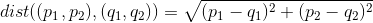

# Python og Pita workshop 2020 - TODO
- [Link til slides](https://docs.google.com/presentation/d/1QwZ_1nFgREZk3raEFPRpUNxN8wlyvoeR7H4Fi6NIhrk/edit#slide=id.g62210f0158_3_30)
- Kode eksempler ligger i `eksempler` mappen
- Man kan også bruge følgende [notebook](https://colab.research.google.com/drive/18Ux2nuOxjlSxSdinqL0JHhgqL5dVqEoK)

## Installation af Python 3
- **Windows:** https://realpython.com/installing-python/#windows
- **MacOS:** https://realpython.com/installing-python/#macos-mac-os-x
- **Linux:** https://realpython.com/installing-python/#linux

## Opgaver - TODO
### Opgave 1
Lav en funktion `my_function`, der tager to nummer og addere dem sammen

**Skabelon**

```python
def my_function(a, b):
    pass

print(my_function(2,3))  # Output: 5
print(my_function(3,5))  # Output: 8
print(my_function(10,7)) # Output: 17
print(my_function(9,7))  # Output: 16
```

### Opgave 2
Lav en funktion, der udregner den euklidiske afstand mellem to punkter `p` og `q`. Punkterne representeres, som en tuple af `x` og `y` koordinaterne. Afstanden kan udregnes vha. følgende formel:


**Skabelon**
```python
from math import sqrt

def distance(p, q):
    pass

print(distance((2,1),(4,1)))    # Output: 2.0
print(distance((4,3),(3,20)))   # Output: 17.029...
print(distance((14,10),(0,11))) # Output: 14.036...
print(distance((13,18),(12,8))) # Output: 10.049...
```

### Opgave 3

Lav en funktion `sum_list`, der tager en liste af tal og ligger den liste af tal sammen

**Skabelon**

```python
def sum_list(lst):
    pass

print(sum_list([3, 0, 3]))           # Output: 6
print(sum_list([8, 8, 0, 7, 7, 8]))  # Output: 38
print(sum_list([2, 1, 8, 8, 8]))     # Output: 27
print(sum_list([1, 3, 3, 7, 2]))     # Output: 16
print(sum_list([4, 0, 5]))           # Output: 9
```

### Opgave 4 - TODO

*While loops*


## Brugbare biblioteker

- Math: https://docs.python.org/3/library/math.html
- Sympy: https://www.sympy.org/en/index.html
- Numpy: https://docs.scipy.org/doc/numpy/reference/
- Matplotlib: https://matplotlib.org/contents.html
- iPython: https://ipython.readthedocs.io/en/stable/

